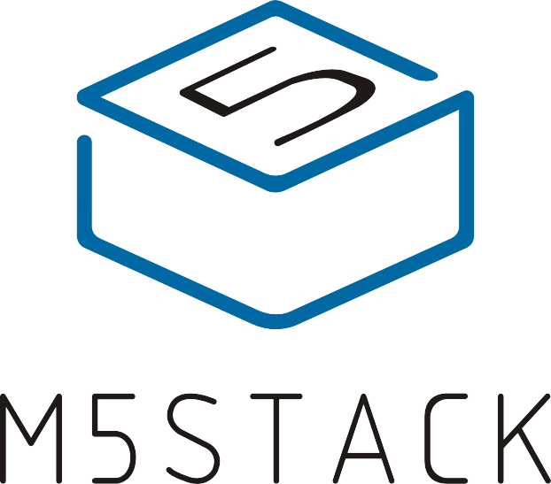

> A documentation for [Heltec Automation products](http://www.heltec.cn/)

- A series of modular stackable development devices integrating WIFI/BLE
- For Industry Development/STEM Education
- Programming with UiFlow(Blockly/MicroPython)

[Official Website](http://www.heltec.cn)

[Introdction](#main)

[Quick Start](/en/quick_start)
